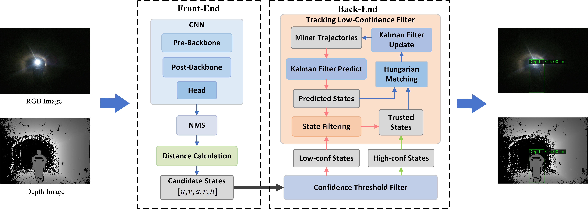
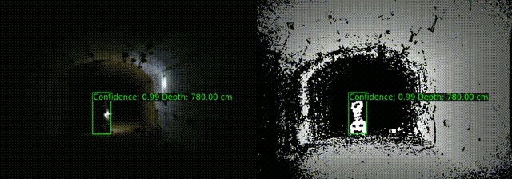

# MD-TLCF: Miner Distance Detection Based on Tracking Low-confidence Filter



## Code

The model is available at the link: https://pan.baidu.com/s/1qJwykWsbm9v5njh2nN3RGw?pwd=qqmw  (extraction code：qqmw ) 

- miner distance detection inference

  ```
  python inference.py
  ```

  

## Dataset

MINERTKRGBD Dataset comprises 34 video sequences, totaling 2362 frames. Each frame encompasses an RGBD image accompanied by corresponding annotated bounding boxes depicting the miners. It can be used for research on miner detection and tracking. The dataset is available at the link:  https://pan.baidu.com/s/1EQbMRkY5gEmYj0KEBAEDKg?pwd=3xnn (extraction code：3xnn) 


